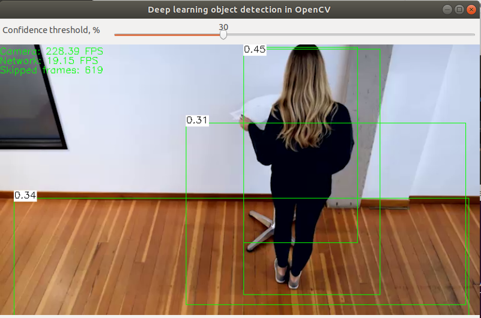
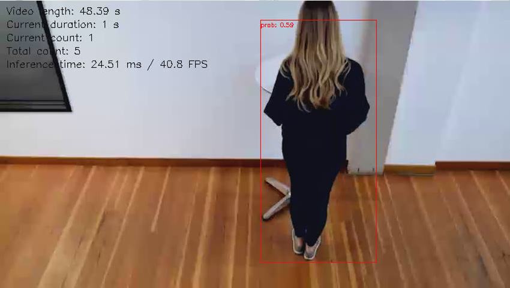

# Project Write-Up

## Preparing model

After trying some models from a [list](https://docs.openvinotoolkit.org/2019_R3/_docs_MO_DG_prepare_model_convert_model_Convert_Model_From_TensorFlow.html), model with name [SSD MobileNet V1 0.75 Depth COCO](http://download.tensorflow.org/models/object_detection/ssd_mobilenet_v1_0.75_depth_300x300_coco14_sync_2018_07_03.tar.gz) was selected

### Dowmload

```
mkdir model
cd model
wget http://download.tensorflow.org/models/object_detection/ssd_mobilenet_v1_0.75_depth_300x300_coco14_sync_2018_07_03.tar.gz
tar -xf ssd_mobilenet_v1_0.75_depth_300x300_coco14_sync_2018_07_03.tar.gz
```

### Convert with Model Optimizer

```
python3 /opt/intel/openvino/deployment_tools/model_optimizer/mo.py \
  --input_model ssd_mobilenet_v1_0.75_depth_300x300_coco14_sync_2018_07_03/frozen_inference_graph.pb \
  --tensorflow_object_detection_api_pipeline_config ssd_mobilenet_v1_0.75_depth_300x300_coco14_sync_2018_07_03/pipeline.config \
  --reverse_input_channels \
  --tensorflow_use_custom_operations_config /opt/intel/openvino/deployment_tools/model_optimizer/extensions/front/tf/ssd_v2_support.json \
  --output_dir .
```

If the error `'Graph' object has no attribute 'node'` occures, follow [this instruction](https://www.intel.com/content/www/us/en/support/articles/000055576/boards-and-kits/neural-compute-sticks.html)

## Run

### Video file input

```
python3 main.py \
  -i resources/Pedestrian_Detect_2_1_1.mp4 \
  -m model/frozen_inference_graph.xml \
  -l /opt/intel/openvino/inference_engine/lib/intel64/libcpu_extension_sse4.so \
  -pt 0.5 \
| ffmpeg \
  -v warning \
  -f rawvideo \
  -pixel_format bgr24 \
  -video_size 768*432 \
  -framerate 24 \
  -i - http://0.0.0.0:3004/fac.ffm
```

### Image file input

```
python3 main.py \
  -i resources/Pedestrian_Detect.jpg \
  -m model/frozen_inference_graph.xml \
  -l /opt/intel/openvino/inference_engine/lib/intel64/libcpu_extension_sse4.so \
  -pt 0.5 \
| ffmpeg \
  -v warning \
  -f rawvideo \
  -pixel_format bgr24 \
  -video_size 768*432 \
  -framerate 24 \
  -i - http://0.0.0.0:3004/fac.ffm
```

## Explaining Custom Layers

The process behind converting custom layers involves:

- Register custom layers as extensiions forr model ooptimizer
- Caculate output shape ot the layer (Caffe-only)
- Replace subgraph eith another (Tensorflow-only)
- Offload the computation of the subgraph (Tensorflow-only)

Some of the potential reasons for handling custom layers are:

- Layer is not supported by OpenVINO ([List of supported layers](https://docs.openvinotoolkit.org/2019_R3/_docs_MO_DG_prepare_model_Supported_Frameworks_Layers.html))
- Adding layers wth addtional pre/post processing

## Comparing Model Performance

My method(s) to compare models before and after conversion to Intermediate Representations
were:

- Using `object_detection.py` script from [OpenCV samples](https://github.com/opencv/opencv/tree/master/samples/dnn) to
  evaluate model performance before conversion:

```
git clone https://github.com/opencv/opencv

python3 opencv/samples/dnn/object_detection.py opencv_fd \
    --model "model/ssd_mobilenet_v1_0.75_depth_300x300_coco14_sync_2018_07_03/frozen_inference_graph.pb" \
    --config "model/ssd_mobilenet_v1_0.75_depth_300x300_coco14_sync_2018_07_03/pipeline.config" \
    --input "resources/Pedestrian_Detect_2_1_1.mp4" \
    --thr 0.30
```



- Using OpenVINO it is possible to measure time before async call `infer_network.exec_net(p_frame)` and after network output is ready:

```python

### Start asynchronous inference for specified request ###
infer_start = time.time()
infer_network.exec_net(p_frame)

### Wait for the result ###
if infer_network.wait() == 0:

    ### Get the results of the inference request ###
    net_output = np.squeeze(infer_network.get_output())
    objects_in_frame, app_state["detection_current"]["count"] = extract_objects(net_output, args.prob_threshold)

    ## Stats
    app_state["stats"]["accum_infer_time"] += time.time() - infer_start
    app_state["stats"]["average_infer_duration"] = app_state["stats"]["accum_infer_time"] / app_state["stats"]["frames_counter"]

```



The difference between model accuracy pre- and post-conversion was also significant:

- With model before conversion it was necessary to define probability threshold not much than `--thr 0.30` to detect
  all the persons in the vdeo

- With converted model `-pt 0.5` is enough

The size of the model pre- and post-conversion was:

- Uncompressed model before conversion: 57,2 MB
- After conversion: 16,5 MB

The inference time of the model pre- and post-conversion was:

- Network performance of the model before conversion is about 19 FPS on the local machine
- Network performance of the model after converson is more than 40 FPS on the same local machine

## Assess Model Use Cases

Some of the potential use cases of the people counter app are:

- Counting people in the retail stores - to understand peak times and involve as many personnel as necessary
- Counting people using public transportation - to optimize bus/trams routes
- Counting people during elections - to automatically count attended people

## Assess Effects on End User Needs

Lighting, model accuracy, and camera focal length/image size have different effects on a
deployed edge model. The potential effects of each of these are as follows:

- Insufficient, as well as too intense lightning can negatively affect a recognition accuracy. The more contrast the object of recognition in relation to the background, the better recognition accuracy.
- Using wide lenses can skew an image, so model re-training can be required
- Image size can affect average inference time because of required image preprocessing
